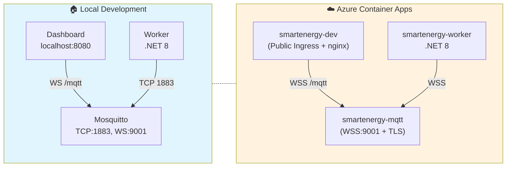
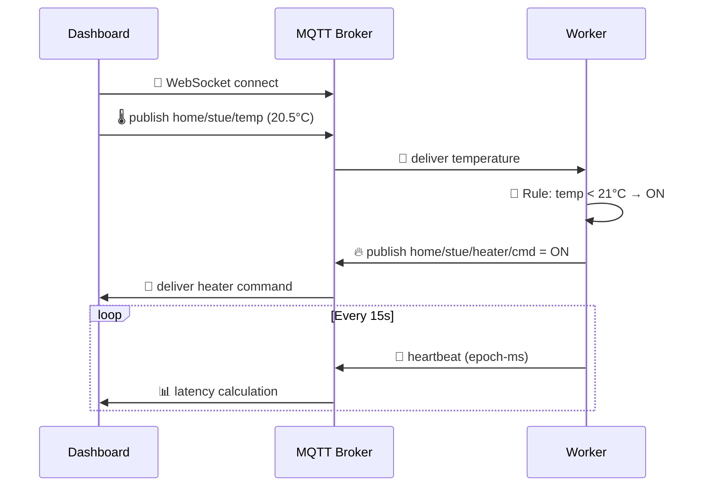
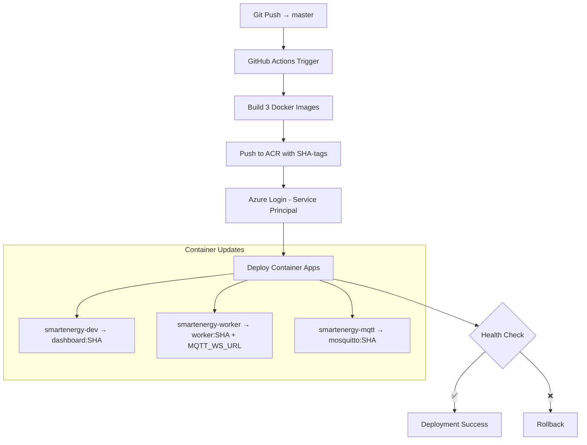

# SmartEnergy IoT Platform

[](https://azure.microsoft.com/en-us/services/container-apps/)
[](https://dotnet.microsoft.com/)
[](https://mqtt.org/)
[](https://www.docker.com/)
[](https://github.com/features/actions)

**Produksjonsklar IoT Edge-plattform for intelligent energistyring**

Real-time MQTT kommunikasjon (TCP lokalt, WSS/TLS i skyen), .NET 8 Worker med regelmotor, og responsive web-dashboard med live data visualisering og latency-måling.

---

## 🚀 Live Demo

| Service | URL | Beskrivelse |
|---------|-----|-------------|
| **Dashboard** | [smartenergy-dev.calmmushroom-56122533.norwayeast.azurecontainerapps.io](https://smartenergy-dev.calmmushroom-56122533.norwayeast.azurecontainerapps.io/) | Interactive web-dashboard med real-time data |
| **MQTT Broker** | `wss://smartenergy-mqtt.<hash>.norwayeast.azurecontainerapps.io/` | WebSocket MQTT over TLS |

*Merk: MQTT broker URL har miljø-spesifikk hash. Se MQTT_WS_URL i Azure for gjeldende verdi.*

---

## ✨ Systemarkitektur

### **Hybrid Cloud Pattern**


### **Real-time Message Flow**


---

## 🏗️ Systemkomponenter

### **3 Mikrotjenester**

| Container | Teknologi | Ansvar |
|-----------|-----------|---------|
| **Dashboard** | nginx + HTML/JS + Chart.js | Web UI, WebSocket proxy, real-time visualisering |
| **Worker** | .NET 8 BackgroundService | MQTT-klient, regelmotor, heartbeat-service |
| **Mosquitto** | Eclipse Mosquitto | MQTT broker (TCP + WebSocket support) |

### **Nøkkelfunksjoner**

- ⚡ **Real-time kommunikasjon** via MQTT over WebSockets
- 🎯 **Intelligent regelmotor** (temperaturbasert styring)
- 📊 **Live dashboard** med Chart.js visualisering
- 📈 **Latency-måling** med epoch-timestamp precision
- 🔄 **Hybrid deployment** (Docker Compose ↔ Azure Container Apps)
- 🚀 **CI/CD pipeline** med GitHub Actions
- 🛡️ **Sikker kommunikasjon** (WSS/TLS i produksjon)

---

## 📡 MQTT Topics

| Topic Pattern | Type | Beskrivelse | Eksempel |
|---------------|------|-------------|----------|
| `home/<rom>/temp` | **Sensor → Broker** | Temperaturmålinger | `home/stue/temp: 22.4` |
| `home/<rom>/<device>/cmd` | **Worker → Aktuator** | Styrekommandoer | `home/stue/heater/cmd: ON` |
| `home/demo/heartbeat` | **System** | Worker heartbeat | `1769494001706` (epoch-ms) |
| `home/demo/ping/<clientId>` | **Dashboard** | Latency-måling | RTT beregning |

### **Regelmotor (MVP)**
```javascript
if (temperature < 21.0) {
    publishCommand("home/stue/heater/cmd", "ON");
} else {
    publishCommand("home/stue/heater/cmd", "OFF");
}
```

---

## 🛠️ Teknologi Stack

### **Frontend**
- **HTML5/CSS3/JavaScript** (Vanilla - ingen rammeverk)
- **Chart.js** for data visualisering
- **mqtt.js** for WebSocket MQTT-klient
- **nginx** som reverse proxy

### **Backend**
- **.NET 8** BackgroundService/HostedService
- **MQTTnet** bibliotek for MQTT-kommunikasjon
- **Microsoft.Extensions.Hosting** for dependency injection

### **Infrastructure**
- **Eclipse Mosquitto** MQTT broker
- **Docker + Docker Compose** for lokal utvikling
- **Azure Container Apps** for sky-deployment
- **Azure Container Registry** for image storage
- **GitHub Actions** for CI/CD

---

## 📦 Prosjektstruktur

```
SmartEnergy/
├── 🐳 docker-compose.yml          # Lokal dev stack
├── 📊 dashboardC/
│   ├── Dockerfile
│   ├── nginx.conf                 # WebSocket proxy config
│   └── wwwroot/
│       └── index.html             # SPA dashboard
├── ⚙️ workerC/
│   ├── Dockerfile
│   ├── Program.cs                 # .NET Host + DI
│   ├── Worker.cs                  # MQTT client + regelmotor
│   ├── Settings.cs                # Configuration POCOs
│   └── appsettings.json           # Lokal konfigurasjon
├── 📡 mosquittoC/
│   ├── Dockerfile
│   ├── mosquitto.conf             # MQTT broker config
│   └── data/                      # Persistent storage
└── 🚀 .github/workflows/
    └── build-deploy.yml           # CI/CD pipeline
```

---

## 🚀 Kom i gang

### **Lokalt (Docker Compose)**

#### **Forutsetninger**
- Docker Desktop
- Git
- (Valgfritt) .NET 8 SDK for utvikling

#### **Start systemet**
```bash
git clone https://github.com/HiwaAbdolahi/SmartEnergy
cd SmartEnergy

# Bygg og start alle tjenester
docker compose up -d --build

# Verifiser at alt kjører
docker ps
# Skal vise: mosquitto, smartenergy, smartenergy-dashboard som "Up"
```

#### **Overvåkning**
```bash
# Se worker logs
docker compose logs -f smartenergy

# Se alle logs
docker compose logs -f

# Åpne dashboard
open http://localhost:8080
```

### **Testing uten fysiske sensorer**

```bash
# Terminal 1 - Overvåk alle meldinger
docker exec -it mosquitto sh -c "mosquitto_sub -t '#' -v"

# Terminal 2 - Simuler temperaturer
docker exec -it mosquitto sh -c "mosquitto_pub -t 'home/stue/temp' -m '20.5'"
docker exec -it mosquitto sh -c "mosquitto_pub -t 'home/stue/temp' -m '22.2'"
docker exec -it mosquitto sh -c "mosquitto_pub -t 'home/stue/temp' -m '19.8'"
```

**Forventet oppførsel:**
- Temp < 21.0°C → `home/stue/heater/cmd = ON`
- Temp ≥ 21.0°C → `home/stue/heater/cmd = OFF`
- Heartbeat hvert 15. sekund
- Dashboard oppdateres i real-time

---

## ☁️ Azure Deployment

### **Infrastruktur**
```bash
Resource Group: rg-smartenergy-dev
Container Registry: smartenergyhiwa.azurecr.io
Container Apps:
  - smartenergy-dev      (dashboard + ingress)
  - smartenergy-worker   (backend service)  
  - smartenergy-mqtt     (MQTT broker + ingress)
```

### **CI/CD Pipeline**

#### **GitHub Secrets Setup**
```bash
# 1) Service Principal (erstatt <SUBSCRIPTION_ID>)
az ad sp create-for-rbac \
  --name "github-sp-smartenergy" \
  --role contributor \
  --scopes /subscriptions/<SUBSCRIPTION_ID>/resourceGroups/rg-smartenergy-dev \
  --sdk-auth
# -> lagre hele JSON som GitHub secret: AZURE_CREDENTIALS

# 2) ACR Push Permission (erstatt <APP_ID> fra JSON over)
ACR_ID=$(az acr show -n smartenergyhiwa -g rg-smartenergy-dev --query id -o tsv)
SP_APPID=<APP_ID>
az role assignment create --assignee $SP_APPID --scope $ACR_ID --role AcrPush
```

#### **Deployment Flow**


### **Verifikasjon**
```bash
# Sjekk kjørende images
az containerapp show -g rg-smartenergy-dev -n smartenergy-worker \
  --query "properties.template.containers[0].image" -o tsv

# Se logs
az containerapp logs show -g rg-smartenergy-dev -n smartenergy-worker --tail 50
```

---

## ⚙️ Konfigurasjoner

### **Worker appsettings.json (lokal)**
```json
{
  "Mqtt": {
    "Host": "mosquitto",
    "Port": 1883,
    "ClientId": "edge-control",
    "User": "",
    "Pass": "",
    "WsUrl": ""
  },
  "Loop": { 
    "IntervalSeconds": 15 
  },
  "Logging": {
    "LogLevel": {
      "Default": "Information"
    }
  }
}
```

### **Environment Variables (Azure)**
```bash
# Worker Container App
MQTT_WS_URL=wss://smartenergy-mqtt.<hash>.norwayeast.azurecontainerapps.io/
```

### **nginx Proxy (Dashboard)**

**Lokal utvikling:**
```nginx
location /mqtt {
    proxy_http_version 1.1;
    proxy_set_header Upgrade $http_upgrade;
    proxy_set_header Connection "Upgrade";
    proxy_set_header Host $host;
    proxy_pass http://mosquitto:9001;  # lokal
}
```

**Azure produksjon:**
```nginx
location /mqtt {
    proxy_http_version 1.1;
    proxy_set_header Upgrade $http_upgrade;
    proxy_set_header Connection "Upgrade";
    proxy_set_header Host $host;
    proxy_ssl_server_name on;
    proxy_pass https://smartenergy-mqtt.<hash>.norwayeast.azurecontainerapps.io/;
}
```

---

## 📊 Observability

### **Logging**
```bash
# Lokal development
docker compose logs -f smartenergy
docker compose logs -f smartenergy-dashboard

# Azure production  
az containerapp logs show -g rg-smartenergy-dev -n smartenergy-worker --tail 100
az monitor activity-log list --resource-group rg-smartenergy-dev
```

### **Metrics Dashboard**
Åpne [Live Dashboard](https://smartenergy-dev.calmmushroom-56122533.norwayeast.azurecontainerapps.io/) for:
- 📊 Real-time temperatur graf
- 🔥 Heater status indikator  
- 💓 System heartbeat
- ⚡ Latency måling (end-to-end)
- 📈 Min/Max/Gjennomsnitt statistikk

---

## 🔐 Sikkerhet

### **Produksjon (Azure)**
- ✅ **TLS/WSS** terminering via Container Apps
- ✅ **Service Principal** autentisering for deploy
- ✅ **ACR tilgang via Service Principal (AcrPush)**
- ✅ **Environment variables** for secrets/konfig

### **Lokal Development** 
- ⚠️ **Anonym MQTT** (allow_anonymous: true)
- ⚠️ **HTTP** (ikke HTTPS lokalt)

### **Planlagte forbedringer**
- 🔐 MQTT brukernavn/passord
- 🛡️ mTLS client certificates
- 🚫 Rate limiting i nginx
- 🔒 Azure Key Vault integration
- 🌐 Private Container Apps Environment

---

## 🛣️ Roadmap

### **Fase 2: Skalerbarhet**
- [ ] **Multi-tenant** arkitektur (flere hjem/bygg)
- [ ] **Time-series database** (InfluxDB/TimescaleDB)
- [ ] **Grafana dashboards** for historisk data
- [ ] **Alert system** (SMS/e-post notifikasjoner)

### **Fase 3: Intelligens**
- [ ] **Machine Learning** prediktiv styring
- [ ] **Anomaly detection** for sensorfeil
- [ ] **Dynamic pricing** integration (Nordpool API)
- [ ] **Weather API** integration for smartere kontroll

### **Fase 4: Ecosystem**
- [ ] **Mobile app** (React Native/Flutter)
- [ ] **Voice control** (Alexa/Google Assistant)
- [ ] **HomeKit/Google Home** integration
- [ ] **Energy reporting** (månedlige rapporter)

---

## 🚀 Performance

| Metric | Lokal (Target) | Azure (Target) | Krav |
|---------|--------|--------|------|
| **Latency** | <5ms | <50ms | <100ms |
| **Throughput** | 1000 msg/s | 500 msg/s | 100 msg/s |
| **Availability** | 99.5% | 99.9% | 99.9% |
| **Recovery Time** | <30s | <60s | <120s |

*Verdier basert på systemdesign og observasjoner under testing*

---

## 🤝 Bidra

### **Development Workflow**
```bash
# Oppdater kun Worker (hurtig iterasjon)
docker compose up -d --build smartenergy

# Clean rebuild (hvis noe henger)  
docker compose down
docker compose build --no-cache
docker compose up -d

# Stopp alle tjenester
docker compose down
```

### **Feature Requests & Bug Reports**
Opprett en [GitHub Issue](https://github.com/HiwaAbdolahi/SmartEnergy/issues) med:
- 🐛 **Bug**: Reproduserbare steg og forventet oppførsel
- 💡 **Feature**: Brukstilfelle og foreslått implementasjon
- 📖 **Documentation**: Forbedringer til README eller kommentarer

---

## 📄 Lisens

MIT License - Se [LICENSE](LICENSE) fil for detaljer.

---

## 👨‍💻 Utvikler

**Hiwa Abdolahi**
- 🌐 Portfolio: [hiwa.azurewebsites.net](https://hiwa.azurewebsites.net)
- 💼 LinkedIn: [Hiwa Abdolahi](https://linkedin.com/in/hiwa-abdolahi)
- 🐙 GitHub: [@HiwaAbdolahi](https://github.com/HiwaAbdolahi)
- 📧 E-post: hiwa.abdolahi.dev@gmail.com

---

<div align="center">

**⭐ Hvis dette prosjektet var nyttig, gi det en stjerne på GitHub!**

[Live Demo](https://smartenergy-dev.calmmushroom-56122533.norwayeast.azurecontainerapps.io/)

</div>
